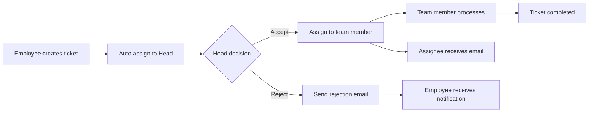

# 🎫 TicketManagement System

An enterprise internal ticket management system built with .NET 8 and Clean Architecture.

## 📋 Project Overview

TicketManagement is an internal request and incident management system that allows employees to create tickets for issues related to IT, Administration (AD), and Quality Assurance (QA). The system automatically routes tickets to appropriate department heads and supports the complete workflow from ticket creation to completion.

## 🏗️ System Architecture

The project is built following **Clean Architecture** pattern with 4 main layers:

```
TicketManagement/
├── 📁 src/
│   ├── 📁 TicketManagement.Api/           # Presentation Layer (API Controllers)
│   ├── 📁 Application/                    # Application Layer (Business Logic)
│   ├── 📁 Domain/                         # Domain Layer (Entities & Business Rules)
│   └── 📁 Infrastructure/                 # Infrastructure Layer (Data Access)
└── 📁 shared/
    └── 📁 BuildingBlocks/                 # Shared Components
```

### 🔧 Main Components

#### **1. Domain Layer**
- **Entities**: Ticket, User, Department, Category, Comment, Progress, Attachment, History
- **Enums**: Priority (High/Medium/Low), Status (Pending/Received/InProgress/Completed/Rejected), DepartmentEnum
- **Interfaces**: IEntity, Repository Interfaces

#### **2. Application Layer**
- **Services**: TicketService, UserService, EmailService, GoogleAuthService, CloudinaryService
- **DTOs**: CreateTicketDto, AssignDto, RejectTicketDto, SendTicketEmailDto
- **Background Services**: EmailBackgroundService, QueuedHostService

#### **3. Infrastructure Layer**
- **Database**: Entity Framework Core with PostgreSQL
- **Repositories**: GenericRepository, UserRepository, TicketRepository
- **Background Tasks**: Queue-based email processing
- **External Integrations**: Gmail API, Cloudinary, Redis

#### **4. API Layer**
- **Controllers**: UserController, TicketController, AuthController
- **Authentication**: JWT + Google OAuth
- **Authorization**: Role-based (Admin, Employee, Head of Department)

## 🛠️ Technology Stack

### **Backend**
- **.NET 9** - Main framework
- **ASP.NET Core** - Web API
- **Entity Framework Core** - ORM
- **PostgreSQL** - Primary database
- **Redis** - Caching & Session management
- **Serilog** - Logging
- **AutoMapper** - Object mapping

### **Authentication & Authorization**
- **JWT (JSON Web Tokens)** - Authentication
- **Google OAuth 2.0** - Single Sign-On
- **ASP.NET Core Identity** - User management

### **External Services**
- **Gmail API** - Email notifications
- **Cloudinary** - File upload & storage
- **Docker** - Containerization

### **Background Processing**
- **Custom Background Service** - Email queue processing
- **Channels** - High-performance message passing

## 🎯 Key Features

### **👤 User Management**
- Registration/Login with Google OAuth
- Role-based permissions (Admin, Employee, Head of Department)
- Personal information management

### **🎫 Ticket Management**
- **Create tickets** with categories: IT, AD, QA
- **Auto-assignment** of tickets to appropriate department heads
- **Progress tracking** with timeline
- **File attachments** (powered by Cloudinary)
- **Comment system** for interactions

### **📧 Notification System**
- **Automatic emails** for ticket creation/assignment/rejection
- **Background processing** for performance
- **Professional email templates**

### **🏢 Department Management**
- **3 main departments**: AD, IT, QA
- **Ticket categories** by specialization
- **Automatic routing** based on category

## 📊 Data Model

### **Core Entities**

```csharp
// Ticket Entity
public class Ticket : Entity
{
    public string Title { get; set; }
    public string Content { get; set; }
    public Priority Priority { get; set; } // High/Medium/Low
    public Status Status { get; set; } // Pending/Received/InProgress/etc.
    
    // Relationships
    public User Creator { get; set; }
    public User? Assignee { get; set; }
    public User HeadOfDepartment { get; set; }
    public Category Category { get; set; }
    public List<Progress> Progresses { get; set; }
    public List<Comment> Comments { get; set; }
}

// User Entity (extends IdentityUser)
public class User : IdentityUser<int>
{
    public string FullName { get; set; }
    public int DepartmentId { get; set; }
    public string? AvatarUrl { get; set; }
    
    // Navigation properties
    public Department Department { get; set; }
    public List<Ticket> CreatedTickets { get; set; }
    public List<Ticket> AssignedTickets { get; set; }
    public List<Ticket> FollowingTickets { get; set; }
}
```

### **Department Categories**
- **AD (Administration)**: Office equipment repair, electrical/water issues, infrastructure maintenance
- **IT**: Software bugs, network issues, IT equipment setup
- **QA**: Service complaints, product consultation, quality feedback

## 🚀 Installation and Setup

### **Prerequisites**
- .NET 8 SDK
- Docker & Docker Compose
- PostgreSQL
- Redis

### **1. Clone repository**
```bash
git clone https://github.com/TrungHoang2003/TicketManagement.git
cd TicketManagement
```

### **2. Setup Environment Variables**
Create a `.env` file in the root directory:
```env
# Database
POSTGRES_CONNECTION_STRING=Host=localhost;Database=ticketDb;Username=root;Password=root

# Redis
REDIS_CONNECTION_STRING=localhost:6379

# JWT Settings
JWT_KEY=your-secret-key
JWT_ISSUER=TicketManagement
JWT_AUDIENCE=TicketManagement

# Google OAuth
GOOGLE_CLIENT_ID=your-google-client-id
GOOGLE_CLIENT_SECRET=your-google-client-secret

# Cloudinary
CLOUDINARY_CLOUDNAME=your-cloud-name
CLOUDINARY_APIKEY=your-api-key
CLOUDINARY_APISECRET=your-api-secret
```

### **3. Run with Docker Compose**
```bash
docker-compose up -d
```

### **4. Manual setup (Development)**
```bash
# Start database & Redis
docker-compose up postgres redis -d

# Restore packages
dotnet restore

# Run migrations
dotnet ef database update --project Infrastructure --startup-project TicketManagement.Api

# Start API
dotnet run --project TicketManagement.Api
```

## 📚 API Documentation

After running the application, access:
- **Swagger UI**: `http://localhost:5105/swagger`
- **Scalar API Reference**: `http://localhost:5105/scalar/v1`

### **Main Endpoints**

#### **Authentication**
- `POST /auth/login` - User login
- `POST /auth/google-login` - Google login
- `POST /auth/refresh` - Refresh token

#### **User Management**
- `POST /user/create` - Create user (Admin only)
- `PUT /user/update` - Update user information
- `GET /user/get_by_department` - Get users by department

#### **Ticket Management**
- `POST /ticket/create` - Create new ticket
- `POST /ticket/assign` - Assign ticket (Head only)
- `POST /ticket/reject` - Reject ticket (Head only)

## 🔐 Authorization System

### **Roles & Permissions**
- **Admin**: Full system management, user creation
- **Employee**: Create tickets, view own tickets
- **Head of IT**: Manage IT tickets
- **Head of AD**: Manage Administration tickets  
- **Head of QA**: Manage QA tickets

### **Authorization Policies**
```csharp
[Authorize(Policy = "AdminOnly")]           // Admin only
[Authorize(Policy = "HeadOfItOnly")]        // Head of IT only
[Authorize(Policy = "HeadOfQaOnly")]        // Head of QA only
[Authorize]                                 // Authenticated users
```

## 🔄 Ticket Workflow



## 🎨 Technical Features

### **Design Patterns**
- **Repository Pattern** - Data access abstraction
- **Unit of Work** - Transaction management
- **CQRS** - Command Query Responsibility Segregation
- **Background Service** - Async email processing
- **Dependency Injection** - IoC container

### **Performance Optimizations**
- **Redis Caching** - JWT token & session caching
- **Background Tasks** - Non-blocking email sending
- **Connection Pooling** - Database optimization
- **File Streaming** - Efficient file upload

### **Security Features**
- **JWT Authentication** - Stateless authentication
- **Role-based Authorization** - Fine-grained permissions
- **SQL Injection Protection** - EF Core parameterized queries
- **CORS Configuration** - Cross-origin security

## 📝 Logs & Monitoring

- **Serilog** - Structured logging
- **File Logging** - Daily rolling files
- **Console Logging** - Development debugging
- **Error Tracking** - Exception handling & logging

## 🤝 Contributing

1. Fork the repository
2. Create feature branch (`git checkout -b feature/AmazingFeature`)
3. Commit changes (`git commit -m 'Add some AmazingFeature'`)
4. Push to branch (`git push origin feature/AmazingFeature`)
5. Open a Pull Request

## 📄 License

This project is licensed under the MIT License - see the [LICENSE](LICENSE) file for details.

## 👨‍💻 Author

**Trung Hoang**
- GitHub: [@TrungHoang2003](https://github.com/TrungHoang2003)
- Email: hoangtrung2003@example.com

---

⭐ **Star this repository if you find it helpful!**
